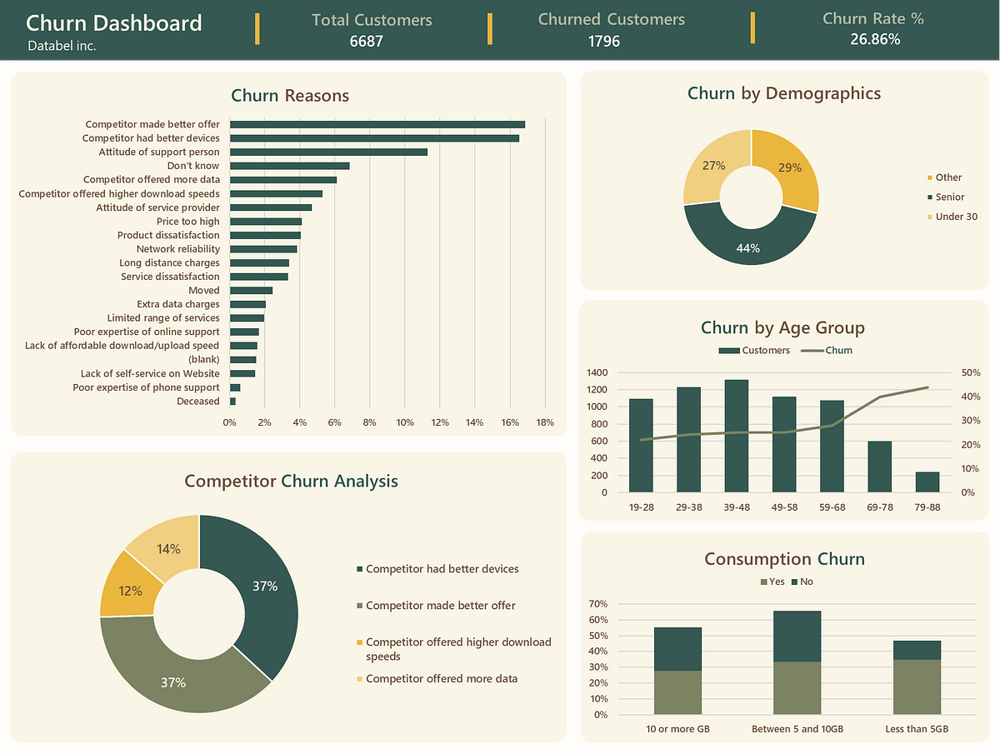
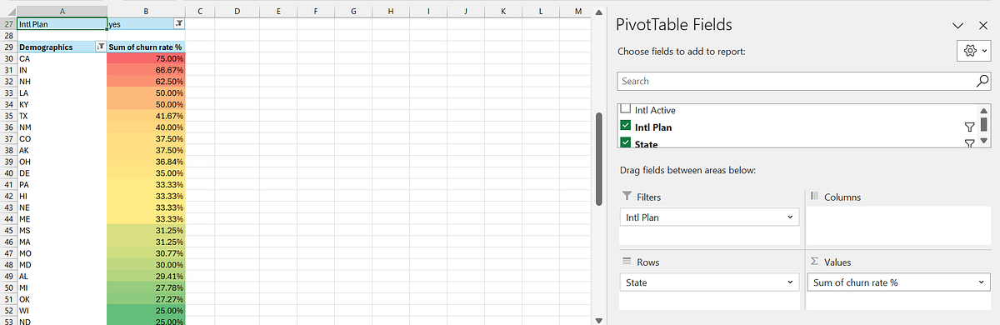

# Databel Customer Churn Using Excel

## Introduction
This Excel project focuses on Customer Churn Analysis for a telecom company named Databel. In this project, I will analyze the factors contributing to customer churn and provide insights to help Databel understand and reduce churn rates. This will ultimately enhance customer retention and grow its customer base.

## Problem Statement
1. What are the primary factors driving customer churn at Databel?
2. What patterns and trends can be identified from the customer data to pinpoint the reasons for churn?
3. How do customer demographics and usage behaviors correlate with customer churn rates?
4. How can these insights be translated into actionable strategies to reduce customer churn and improve retention?

## Skills Demonstrated
The following Excel features were incorporated:
- Logical Functions
- Conditional Formulas
- Pivot Tables
- Filters
- Exploratory Data Analysis

## Data Sourcing
The dataset for this analysis was sourced from a DataCamp case study - [Analyzing Customer Churn in Excel](https://medium.com/r/?url=https%3A%2F%2Fapp.datacamp.com%2Flearn%2Fcourses%2Fcase-study-analyzing-customer-churn-in-excel) and the link to the dataset can be found [here](https://medium.com/r/?url=https%3A%2F%2Fs3.amazonaws.com%2Fassets.datacamp.com%2Fproduction%2Frepositories%2F6386%2Fdatasets%2FDatasets%2Band%2BWorkbooks.zip).

The dataset contains 29 columns and 6,688 rows, each representing a unique customer.

## Data Preprocessing
I conducted a thorough evaluation of the dataset to identify any potential data quality issues that might require cleaning. 

Some of the applied steps include:
- Converting the data range into a table for easier manipulation and analysis
- Utilizing Excel's "Remove Duplicates" feature to ensure the dataset was free of repeated entries
- Creating a new column "churned" to the customer's table that assigns numeric values to the return response of YES and NO. If YES, then 1, else 0. `=IF([@[Churn Label]]="Yes", 1, 0)`

It's worth noting that no issues were found within the dataset.

## Data Analysis
### Exploratory Data Analysis 
This aim is to summarize essential data characteristics using visual methods and summary statistics. This plays a pivotal role for Databel by identifying complex patterns in churn rates, pinpointing anomalies, and validating assumptions through comprehensive analysis and graphical representations.

The steps include:
- Calculating churn
- Investigating churn
- Digging Deeper into Churn Categories

### Advanced Data Analysis
A more thorough analysis which included taking a holistic approach to uncover deeper, more detailed insights.

The steps include:
- Analyzing demographics
- Analyzing age groups
- Analyzing call plans
- Analyzing international call behaviors 

The Data analysis was well detailed in my article [here]()

## Data Visualization & Summary Insights

From the Dashboard, it is observed that:
1. The calculated churn rate for Databel stands at 26.86%
2. The top three reasons for customer churn are:
   - Competitors made better offer
   - Competitors had better devices
   - Attitude of support person
3. 37.64% of customers left because competitors made better offers
4. The demographic group with the highest churn rate is 'Senior'
5. The age group "79–88," despite having the smallest number of customers, has the highest churn rate
6. The churn rate for people on an unlimited plan who consume less than 5GB of data is 34.69%
7. 
   California (CA) has a particularly high percentage of churners among customers on an international plan.

## Conclusion & Recommendations
1. Introduce competitive offers and device upgrades that match or surpass competitors' offerings, alongside loyalty programs featuring discounts, special offers, and exclusive services to reward long-term customers, thereby enhancing satisfaction and retention.
2. Invest in comprehensive training programs for support staff to improve customer interaction and satisfaction.
3. Develop retention programs and incentives specifically tailored for senior citizens to lower churn rates, and foster community engagement through events, clubs, or personalized communications to strengthen their loyalty.
4. Create customized plans and services for different age groups, especially those aged 79–88, and use personalized marketing strategies to highlight the benefits and value of these tailored plans to each demographic.
5. Re-evaluate unlimited data plans to offer better value for low-data users by introducing flexible options and analyze data usage patterns to align with customer needs and preferences.
6. Enhance the value proposition of international call plans through competitive pricing, better features, or added benefits. Offer loyalty rewards or discounts to long-term users of these plans to increase satisfaction and retention.
7. Use data analytics to personalize engagement strategies and proactively support customers showing early signs of dissatisfaction or potential churn, enhancing retention efforts.

